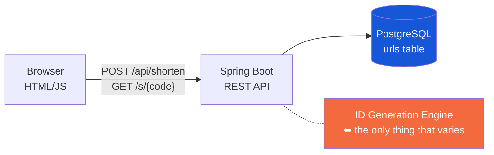
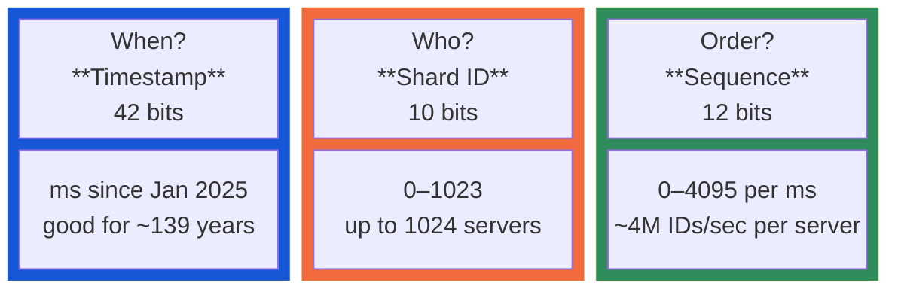
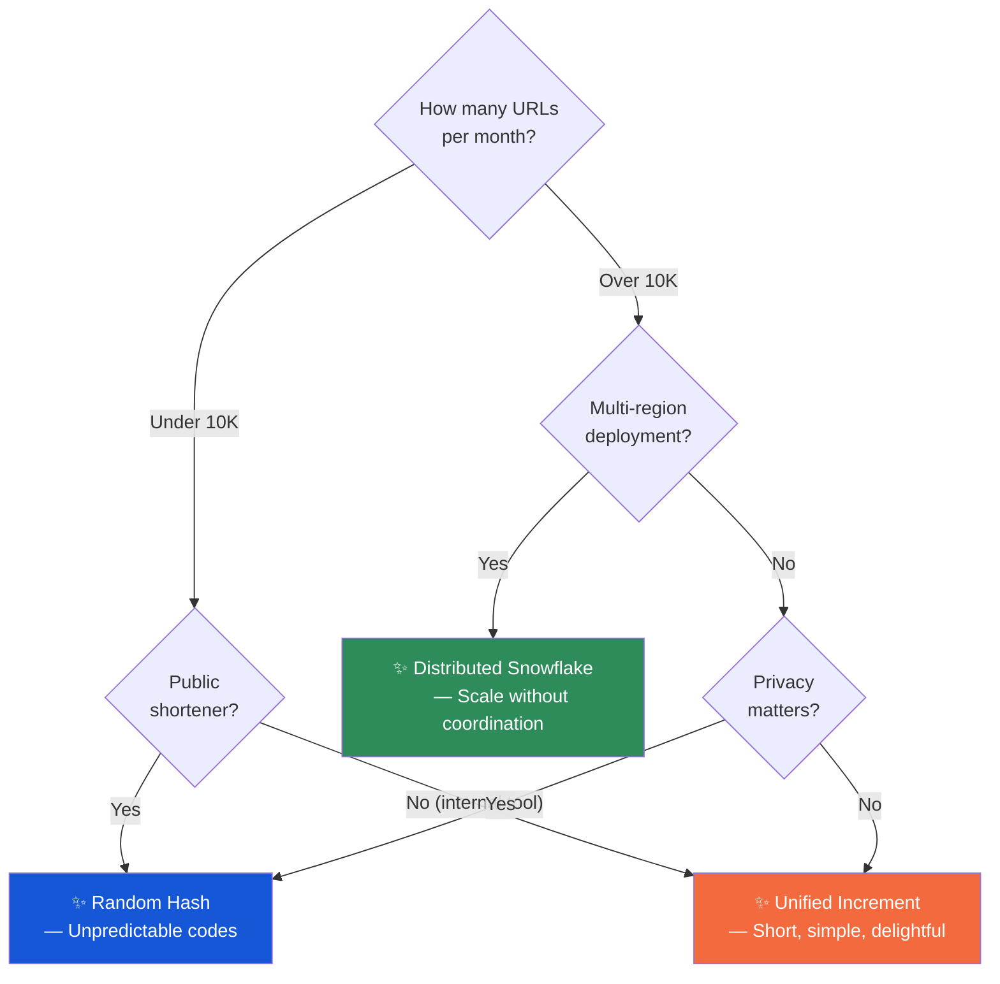

## The Problem

A fintech startup I worked with needed a link shortener for SMS campaigns, QR codes, and email signatures. Nothing exotic — until you look at what those use cases actually demand.

SMS messages have a 160-character ceiling. Every character in a short link is one fewer character available for the message itself. QR codes with shorter URLs produce simpler patterns that scan faster on cheap Android phones. Email signatures should be clean, not dominated by a giant tracking link.

And then there are the hard constraints that come with any link that lives in the wild:

1. **Uniqueness, period.** A collision is not a "failed request." It's a link that already went out to a customer now pointing to the wrong destination. You don't get a second chance.
2. **No single point of failure.** If one server or one region goes down, the system keeps shortening and redirecting links. Customers never notice.
3. **Idempotency.** Shorten the same URL twice, get the same short code back. Otherwise you end up with five different codes for your homepage and your analytics are a mess.
4. **Redirects in single-digit milliseconds.** This is the hot path. A redirect is a database lookup. If it's slow, you built it wrong.

That's the puzzle: **globally unique, compact, collision-free IDs generated at scale without coordination.**

---

## The Approach

It would have been easy to pick one strategy and defend it. Instead, we framed this as an experiment: build the same application three times, swapping out only the ID generation engine. One codebase, three Git branches, three answers to the same question.

The shared infrastructure is deliberately boring. Spring Boot handles HTTP. PostgreSQL stores the data. A plain HTML page serves as the frontend — no framework, no build step, just a form and a fetch call. The database schema is a single table with two indexes, one for redirect lookups and one for deduplication checks.



The only variable — the entire purpose of this article — is the service layer highlighted in orange. How do you assign an identity? Three answers follow.

---

## Approach 1 — Just Pick a Random Number

The simplest answer is also the boldest: **don't coordinate at all.** Generate a random number, encode it into a compact string, and move on with your life.

Here's what actually happens when a URL comes in. First, check if we've seen it before — if so, return the existing code. No point generating a new one for the same destination. If it's new, produce a cryptographically random 64-bit number, encode it to Base62, and save it.

Base62 is worth explaining because it's the quiet workhorse behind all three approaches. It uses 62 symbols — digits, uppercase letters, lowercase letters — to turn integers into strings. The number 1 becomes `"1"`. Number 10 becomes `"A"`. Number 62 becomes `"10"`. It's compact, URL-safe (unlike Base64 with its `+` and `/` characters), and human-readable enough that you can type a short code without squinting.

The elegance of the random approach is in what it *doesn't* do. No central counter. No coordination between servers. No clock synchronization. Nine quintillion possible values means the birthday paradox doesn't become a practical concern until you're storing billions of entries — and even then, the collision check catches it and retries with a tiny salt.

**What you gain:** Simplicity, statelessness, and unpredictability. An attacker cannot enumerate your links by guessing codes. They reveal nothing about your volume, your ordering, or your internals.

**What you give up:** Compactness and ordering. A random 64-bit integer encodes to roughly 11 Base62 characters. And you lose any sense of sequence — you can't look at two short codes and know which URL was created first.

For a public URL shortener where privacy matters, this is often the right call.

---

## Approach 2 — Let the Database Count

If you're willing to centralize, the database can do the heavy lifting.

Instead of generating an ID yourself, you ask PostgreSQL: "What's the next number?" The database has a built-in mechanism for this — a sequence — that atomically returns a monotonically increasing integer every time you ask. No two callers get the same number, no matter how many requests arrive concurrently.

Once you have that integer — say, 42 — you encode it to Base62 and store everything in one row. The short code for 42: `"G"`. Two characters once you hit 62. Three once you pass 3,843. The codes stay remarkably short because you're counting from the beginning.

There's a subtlety here worth mentioning because it bit us in production. When you save an entity that already has an ID (and ours does — we got it from the sequence), Spring Data JDBC assumes the row exists and tries to update it. It doesn't. The fix is a one-line interface that tells the framework: "Trust me, insert this." It's the kind of detail that separates a working prototype from something you'd deploy. If you're curious about the implementation, it's in the repository — look for `Persistable` and the factory method on `UrlEntity`.

**What you gain:** Guaranteed uniqueness from the database itself. The shortest possible codes at low volumes — single characters for the first 62 links. Simple and predictable.

**What you give up:** Horizontal scalability and privacy. All writes funnel through a single sequence. At a few thousand requests per second, this is fine. At a million, it's not. And the predictability is a double-edged sword — an attacker who understands the pattern can walk through every link in your system by incrementing the short code.

For an internal tool with modest volume, this is usually the right call.

---

## Approach 3 — Pack Time, Identity, and Order into a Single Number

What if every server could generate globally unique IDs independently, never talking to a central counter, never coordinating with other servers — and still guarantee no collisions?

That's the insight behind Twitter's Snowflake algorithm, which we adapted into a simplified version for our shortener. The idea is to use the 64 bits of a long integer as a container for three pieces of information:



**The timestamp** (42 bits) captures milliseconds since January 1, 2025. Every ID embeds when it was born, and we have about 139 years before we run out of bits.

**The shard ID** (10 bits) identifies which server created the ID. In our setup, each Kubernetes pod derives its shard ID automatically from its hostname — a quick hash, modulo 1024. No manual config. No service discovery. In local development, you can set it explicitly with an environment variable.

**The sequence number** (12 bits) counts IDs within a single millisecond on a single server. If a server somehow pumps out more than 4,096 IDs in the same millisecond, it waits for the clock to tick forward. In practice, that ceiling is about 4 million IDs per second per server — far beyond what any URL shortener would ever need.

Put these three components together at their respective bit positions, and you get a 64-bit integer that is guaranteed to be globally unique across your entire fleet. Two servers at the same millisecond? Different shard IDs. Same server at the same millisecond? Different sequence numbers. The only thing that can break it is the system clock ticking backward — and we detect that and refuse to generate rather than risk a collision.

From there it's the same Base62 encode → save path as the other approaches. Except the ID came from local memory, not a database round-trip.

**What you gain:** Zero coordination. Truly horizontal scale — 1,024 servers, 4 million IDs per second each, zero cross-talk. Rough chronological ordering from the embedded timestamp.

**What you give up:** Code length. A full 64-bit ID encodes to about 11 Base62 characters — not as compact as the increment approach at low volume. And the implementation involves bit manipulation, sequence overflow handling, and clock drift monitoring. It's more complex.

For a high-throughput platform deployed across multiple regions, this is usually the right call.

---

## The Comparison

| | Random Hash | Unified Increment | Distributed Snowflake |
|---|---|---|---|
| **How IDs are made** | Roll the dice | Ask the DB counter | Pack time + machine + order |
| **Coordination needed** | None | DB sequence | None |
| **Horizontal scale** | Excellent | Limited | Excellent |
| **Code length (typical)** | ~11 chars | 1–7 chars (grows with volume) | ~11 chars |
| **Can you enumerate links?** | No | Yes | Partially |
| **Complexity** | Low | Low | Medium |
| **Best for** | Public shorteners, privacy-sensitive | Internal tools, modest volume | Multi-region, high throughput |

---

## Performance Reality Check

All three approaches were profiled under the same conditions. The redirect path — the one every user hits — is a single indexed database lookup and returns in under 3 milliseconds regardless of which approach generated the ID. The write path is slightly faster for Snowflake (~3,100/sec vs ~2,700/sec) because it skips the database round-trip for ID generation.

But honestly, at these scales, the bottleneck isn't the ID generation at all. It's the database INSERT and its write-ahead log. All three approaches will saturate your database write capacity long before their algorithms break. The differences are architectural — coordination, predictability, operational footprint — not raw throughput.

---

## So Which One?

**Internal tool with modest volume → Unified Increment.** You get the shortest codes, the simplest codebase, and the database sequence won't be your bottleneck at a few thousand inserts per day. Single-character codes are genuinely delightful.

**Public URL shortener → Random Hash.** If strangers are creating links that might point to private documents, you need unpredictability. The increment approach leaks information about your volume and lets anyone walk through your entire link graph.

**High-throughput, multi-region platform → Distributed Snowflake.** When you're deploying across continents and serving millions of requests per minute, you need coordination-free ID generation. The added complexity of bit manipulation and clock monitoring pays for itself the first time you deploy to a second region and everything just works — no shared counter, no distributed lock, no surprises.



---

## Explore the Code

All three approaches live in one repository, each on its own branch. Switch, run, compare:

```bash
git checkout main                           # Random Hash
git checkout approach-2-unified-increment    # DB Sequence
git checkout approach-3-distributed-increment # Snowflake

docker compose up -d
./gradlew bootRun        # → http://localhost:8080
```

Each branch carries 38 to 44 tests covering uniqueness, concurrency, edge cases, and the full HTTP cycle. No flaky tests, no skipped assertions — every approach stands on its own.

---

## Tech Stack

Java 21 &middot; Spring Boot 3.4 &middot; Spring Data JDBC &middot; PostgreSQL &middot; Docker Compose &middot; HTML/CSS/JavaScript &middot; JUnit 5 &middot; Mockito &middot; Gradle &middot; Base62 Encoding &middot; Snowflake Algorithm

---

*Three approaches. One codebase. The fundamentals of distributed identity, explored.*
