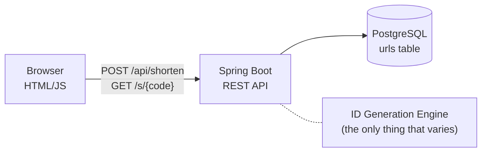
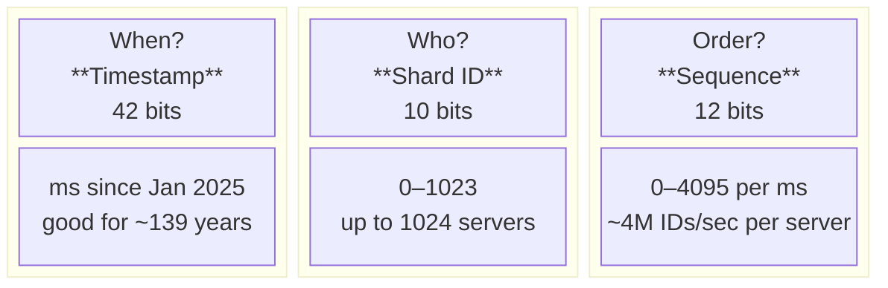
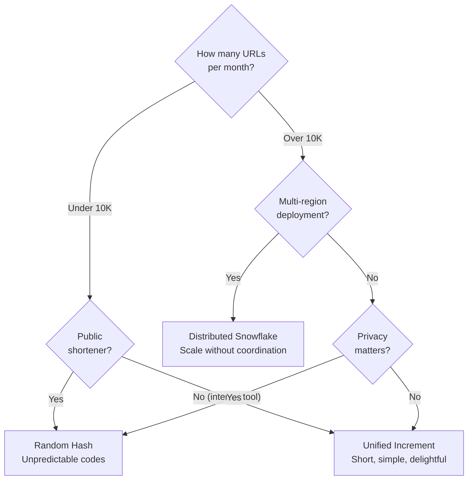

## The Problem

A URL shortener is one of those classic system design problems that sounds trivial until you actually think about it. Shorten a link, redirect it, done. But the reasons short links exist in the first place push you toward some genuinely interesting constraints.

Think about where short links get used. SMS caps you at 160 characters, so every character your link eats is one less for the actual message. Shorter URLs make simpler QR patterns, which scan noticeably faster on cheap phones. And nobody wants an email signature dominated by some giant tracking link.

Then there are the constraints that come with any link released into the wild:

1. **Uniqueness, period.** A collision isn't a failed request you can retry. It's a link that already went out to customers and now points at the wrong thing. There's no fixing that after the fact.
2. **No single point of failure.** If one server or one region goes down, the system keeps shortening and redirecting. Customers never notice.
3. **Idempotency.** Shorten the same URL twice, you should get the same code back. Otherwise you end up with five different codes for your homepage and your analytics become garbage.
4. **Redirects in single-digit milliseconds.** This is the hot path. A redirect is one database lookup. If that's slow, something went wrong somewhere.

So the real puzzle is this: globally unique, compact, collision-free IDs, generated at scale, without servers having to talk to each other.

---

## The Approach

The easy thing would have been to pick one strategy and argue for it. Instead, I turned it into an experiment: build the same app three times and only swap out the ID generation engine. One codebase, three Git branches, three answers to the same question.

Everything around the ID generator is intentionally dull. Spring Boot for HTTP, PostgreSQL for storage, and a plain HTML page for the frontend. No framework, no build step, just a form and a fetch call. The schema is one table with two indexes: one for redirect lookups, one for dedup checks.



The only thing that changes, and the whole point of this article, is the ID generation engine. How does a URL get its identity? Here are three answers.

---

## Approach 1 — Just Pick a Random Number

The simplest answer is also kind of the boldest: don't coordinate at all. Generate a random number, encode it, and move on.

When a URL comes in, the service first checks if it's been seen before. If it has, it returns the existing code, because there's no point minting a second one for the same destination. If it's new, it generates a cryptographically random 64-bit number, Base62-encodes it, and saves it.

Quick aside on Base62, since it shows up in all three approaches. It's just 62 symbols (digits, uppercase letters, lowercase letters) used to write numbers as strings. The number 1 becomes `"1"`, 10 becomes `"A"`, 62 becomes `"10"`. It's compact, URL-safe (Base64's `+` and `/` are a pain in URLs), and readable enough that you can actually type a short code without squinting.

What I like about the random approach is everything it doesn't do. No central counter. No coordination between servers. No clock synchronization. With nine quintillion possible values, the birthday paradox doesn't become a real problem until you're storing billions of links, and even then the collision check just catches it and retries with a tiny salt.

**What you get:** simplicity, statelessness, and unpredictability. Nobody can enumerate your links by guessing codes. The codes leak nothing about your volume, your ordering, or your internals.

**What it costs you:** compactness and ordering. A random 64-bit number encodes to about 11 Base62 characters. And there's no sequence to speak of. Given two codes, you can't tell which link was created first.

If you're building a public shortener and privacy matters, this is probably your answer.

---

## Approach 2 — Let the Database Count

If you're okay centralizing, the database will happily do the work.

Instead of making an ID yourself, you ask PostgreSQL for the next number. Sequences are built for exactly this: they hand out atomically increasing integers, and no two callers ever get the same one, no matter how many requests hit at the same time.

Say you get 42 back. You Base62-encode it (`"G"`) and store everything in one row. Because you're counting from the start, codes stay impressively short. Two characters once you pass 62 links. Three once you pass 3,843.

One gotcha that cost me a couple of hours while building this: when you save an entity that already has an ID (this one does, since it came from the sequence), Spring Data JDBC assumes the row already exists and issues an update. It doesn't exist, so nothing gets written and you get no error telling you why. The fix is a one-line interface that tells the framework "trust me, this is an insert." It's a small detail, but it's the kind of thing that separates a demo from something you'd actually ship. If you want the specifics, look for `Persistable` and the factory method on `UrlEntity` in the repo.

**What you get:** uniqueness guaranteed by the database itself, the shortest codes possible at low volume (single characters for your first 62 links), and a design that's easy to reason about.

**What it costs you:** scale and privacy. Every write funnels through one sequence. That's fine at a few thousand requests per second and not fine at a million. And the predictability cuts both ways: anyone who figures out the pattern can walk through every link in your system just by incrementing the code.

For an internal tool with modest traffic, this is probably your answer.

---

## Approach 3 — Pack Time, Identity, and Order into a Single Number

What if every server could mint globally unique IDs on its own, with no central counter and no coordination, and still never collide?

That's the idea behind Twitter's Snowflake algorithm, which I adapted into a simplified version for this project. You treat the 64 bits of a long integer as a container holding three facts:



**The timestamp** (42 bits) holds milliseconds since January 1, 2025. Every ID remembers when it was born, and there's roughly 139 years before the bits run out.

**The shard ID** (10 bits) says which server made the ID. In this setup, each Kubernetes pod derives its shard ID from its hostname: a quick hash, modulo 1024. No manual config, no service discovery. For local development you can just set an environment variable.

**The sequence number** (12 bits) counts IDs created within the same millisecond on the same server. If a server somehow produces more than 4,096 IDs in one millisecond, it waits for the clock to tick forward. That ceiling works out to about 4 million IDs per second per server, which is far more than any URL shortener will ever need.

Combine the three at their bit positions and you get a 64-bit integer that's globally unique across the whole fleet. Two servers in the same millisecond? Different shard IDs. Same server, same millisecond? Different sequence numbers. The one thing that can break it is the system clock jumping backwards, so the generator detects that and refuses to produce an ID rather than risk a collision.

After that, it's the same Base62-encode-and-save path as the other approaches. The only difference is the ID came from local memory instead of a database round-trip.

**What you get:** zero coordination and real horizontal scale. 1,024 servers, 4 million IDs per second each, nobody talking to anybody. Plus rough chronological ordering baked in for free, thanks to the embedded timestamp.

**What it costs you:** code length and complexity. A full 64-bit ID encodes to about 11 Base62 characters, so it's no more compact than the random approach. And there's real implementation work here: bit manipulation, sequence overflow handling, clock drift monitoring.

For a high-throughput platform spread across regions, this is probably your answer.

---

## The Comparison

| | Random Hash | Unified Increment | Distributed Snowflake |
|---|---|---|---|
| **How IDs are made** | Roll the dice | Ask the DB counter | Pack time + machine + order |
| **Coordination needed** | None | DB sequence | None |
| **Horizontal scale** | Excellent | Limited | Excellent |
| **Code length (typical)** | ~11 chars | 1–7 chars (grows with volume) | ~11 chars |
| **Can you enumerate links?** | No | Yes | Partially |
| **Complexity** | Low | Low | Medium |
| **Best for** | Public shorteners, privacy-sensitive | Internal tools, modest volume | Multi-region, high throughput |

---

## Performance Reality Check

I profiled all three under the same conditions. The redirect path, the one every user actually hits, is a single indexed lookup and comes back in under 3 milliseconds no matter which approach generated the ID. Writes are a touch faster with Snowflake (~3,100/sec vs ~2,700/sec) because it skips the database round-trip for ID generation.

Honestly though, at these volumes the ID generation isn't the bottleneck at all. It's the database INSERT and its write-ahead log. All three approaches will max out your database write capacity long before the algorithms themselves break. The real differences are architectural: coordination, predictability, operational footprint. Not raw speed.

---

## So Which One?

**Internal tool with modest volume → Unified Increment.** You get the shortest codes, the simplest codebase, and the sequence won't break a sweat at a few thousand inserts a day. Single-character short codes are also just really satisfying.

**Public URL shortener → Random Hash.** If strangers are creating links that might point to private documents, you need codes nobody can guess. The increment approach advertises your volume and lets anyone crawl your entire link graph.

**High-throughput, multi-region platform → Distributed Snowflake.** Once you're deploying across continents and serving millions of requests per minute, coordination-free ID generation stops being a luxury. The bit-twiddling and clock monitoring pay for themselves the first time you spin up a second region and everything just works. No shared counter, no distributed lock, no surprises.



---

## Explore the Code

All three approaches live in one repository, one per branch. Switch, run, compare:

```bash
git checkout main                           # Random Hash
git checkout approach-2-unified-increment    # DB Sequence
git checkout approach-3-distributed-increment # Snowflake

docker compose up -d
./gradlew bootRun        # → http://localhost:8080
```

Each branch carries 38 to 44 tests covering uniqueness, concurrency, edge cases, and the full HTTP cycle. No flaky tests, no skipped assertions. Every approach has to stand on its own.

---

## Tech Stack

Java 21 &middot; Spring Boot 3.4 &middot; Spring Data JDBC &middot; PostgreSQL &middot; Docker Compose &middot; HTML/CSS/JavaScript &middot; JUnit 5 &middot; Mockito &middot; Gradle &middot; Base62 Encoding &middot; Snowflake Algorithm

---

*Three approaches. One codebase. The fundamentals of distributed identity, explored.*
